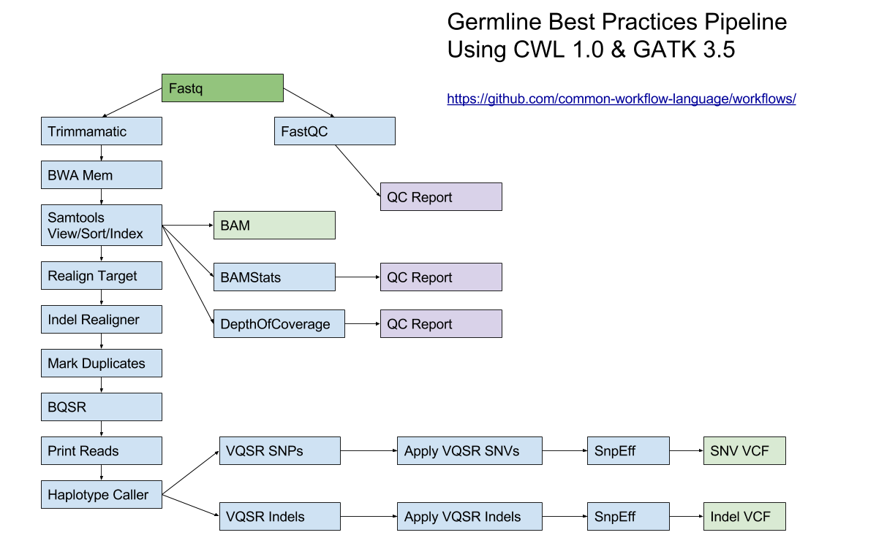

# GATK h3abionet pipeline docs

##Overview
A [GATK best-practices](https://software.broadinstitute.org/gatk/best-practices/bp_3step.php?case=GermShortWGS) germline workflow designed to work with GATK 3.5  (Van der Auwera et al., 2013).

## Pipeline



# Dependencies
The pipeline rely on the following requirements.

## System

* Docker
* cwltools

## Workflow Tools
### FastQC
FastQC is used as an initial QC step where the input files are checked for usual metrics such as:
	- Read length
	- Reads distribution
	- GC content
	- ...

### Trimmomatic
Trimmomatic is the entry point of the pipeline, it is used to cleanup the reads in the input fastq files from any sequencing adaptors.

### BWA
[BWA](http://bio-bwa.sourceforge.net) is used to align the reads from the the input fastq files -paired-ends- (Li, 2013). We use specifically `bwa mem` as recommended by the [GATK best-practices](https://software.broadinstitute.org/gatk/best-practices/bp_3step.php?case=GermShortWGS). BWA produces a SAM file containing the aligned reads against the human reference genome (hg19, GATK bundle build 2.8).

As GATK tools downstream requires properly formatted Read Group information. We add by default 'toy' Read Group information while processing the alignment to the output SAM file. we specifically use the flag `-R '@RG\tID:foo\tSM:bar\tLB:library1'`.

### SAMtools
[SAMtools](http://www.htslib.org) (Li et al., 2009) are used few times in the pipeline:
	1. Convert BWA's output from a SAM format to a BAM format
	2. Sort the reads in the generated BAM file in step 1 (above)
	3. Indexing the BAM file for the following tools to use

### Picard
[Picard tools](https://broadinstitute.github.io/picard/) are used to mark duplicated reads in the aligned and sorted BAM file, making thus the files lighter and less prone to errors in the downstream steps of the pipeline.

### GATK
[Genome Analysis Tool Kit](https://software.broadinstitute.org/gatk) refered to as GATK (DePristo et al., 2011) is used to process the data throught multiple steps as described by the [GATK best-practices](https://software.broadinstitute.org/gatk/best-practices/bp_3step.php?case=GermShortWGS) (i.e. figure bellow).

The GATK steps are the following:
	1. Indel Realignment:
		1. [Realign Target Creator](https://software.broadinstitute.org/gatk/documentation/tooldocs/org_broadinstitute_gatk_tools_walkers_indels_RealignerTargetCreator.php)
		2. [Indel Realigner](https://software.broadinstitute.org/gatk/documentation/tooldocs/org_broadinstitute_gatk_tools_walkers_indels_IndelRealigner.php)
	2. Mark Duplicates (a picard step)
	3. Base Quality Score Recalibration (BQSR):
		1. [Base Recalibrator](https://software.broadinstitute.org/gatk/documentation/tooldocs/org_broadinstitute_gatk_tools_walkers_bqsr_BaseRecalibrator.php)
		2. [Print Reads](https://software.broadinstitute.org/gatk/documentation/tooldocs/org_broadinstitute_gatk_tools_walkers_readutils_PrintReads.php)
	4. [Haplotype Caller](https://software.broadinstitute.org/gatk/documentation/tooldocs/)
	5. Variant Quality Score Recalibration (VQSR):
		1. [Variant Recalibrator](https://software.broadinstitute.org/gatk/documentation/tooldocs/org_broadinstitute_gatk_tools_walkers_variantrecalibration_VariantRecalibrator.php)
		2. [Apply Recalibration](https://software.broadinstitute.org/gatk/documentation/tooldocs/org_broadinstitute_gatk_tools_walkers_variantrecalibration_ApplyRecalibration.php)

### SnpEff
SNPEff is used in this pipeline to annotate the variant calls (Cingolani et al., 2012). The annotation is extensive and uses multi-database approach to provide the user with as much information about the called variants as possible.

### BAMStat
[BAMStats](http://bamstats.sourceforge.net), is a simple software tool built on the Picard Java API (2), which can calculate and graphically display various metrics derived from SAM/BAM files of value in QC assessments.

## Reference Files
The reference files are pulled from the GATK bundle v2.8 (hg19). The used files are:
  - Human reference genome hg19
  - dbSNP build 138
  - HapMap reference data
  - 1000 genome SNPs and indels
  - 1000 genome Omni
  - Mills 1000 genome gold standard variants

# Running
We use the CWL reference implementation.
```
    cwltool --cachedir <path_to_tmp_dir> --debug --non-strict --tmpdir-prefix  GATK-complete-Workflow-h3abionet.cwl GATK-complete-Workflow-copy-h3abionet.json
```

# Output

Here's the sample output.

```
-rw-r--r-- 1 ubuntu ubuntu 497M Aug 26 15:19 samtools-view-2016-08-04.bam
-rw-r--r-- 1 ubuntu ubuntu 403M Aug 26 15:19 samtools-sort-2016-08-04.bam
-rw-r--r-- 1 ubuntu ubuntu 9.3M Aug 26 15:19 HaplotypeCaller-2016-08-04.vcf
-rw-r--r-- 1 ubuntu ubuntu 2.0M Aug 26 15:19 bamstats_report.zip
-rw-r--r-- 1 ubuntu ubuntu 875K Aug 26 15:19 BaseRecalibrator-2016-08-04.table
-rw-r--r-- 1 ubuntu ubuntu 4.2M Aug 26 15:19 samtools-sort-2016-08-04.bai
-rw-rw-r-- 1 ubuntu ubuntu 1.6G Aug 26 15:19 bwa-mem-2016-08-04.sam
-rw-r--r-- 1 ubuntu ubuntu 862M Aug 26 15:19 PrintReads-2016-08-04.bam
-rw-r--r-- 1 ubuntu ubuntu  81M Aug 26 15:19 RealignTargetCreator-2016-08-04.intervals
-rw-r--r-- 1 ubuntu ubuntu 408M Aug 26 15:19 MarkDuplicates-2016-08-04.bam
-rw-r--r-- 1 ubuntu ubuntu 414M Aug 26 15:19 IndelRealigner-2016-08-04.bam
-rw-r--r-- 1 ubuntu ubuntu 5.2M Aug 26 15:19 MarkDuplicates-2016-08-04.bai
-rw-r--r-- 1 ubuntu ubuntu  13K Aug 26 15:19 genome.fa.dict
```

# TODO

- [ ] streaming between steps to improve throughput, currently not supported via the reference implementation
   - [ ] need to stream between samtools/bwa steps for performance
- [ ] properly configuring/exposing threads per step to maximize speed of the steps, really need to refer to [GATK's guidelines](http://gatkforums.broadinstitute.org/gatk/discussion/1975/how-can-i-use-parallelism-to-make-gatk-tools-run-faster) for this since each tool has an optimal setting.
- [ ] remove the dictionary creation steps
- [ ] clearly document the reference files needed
- [ ] dealing with the CWL input file directory being not writable (this prevents GATK from making VCF index files on the fly). The error looks like this: `WARN  09:30:55,672 RMDTrackBuilder - Unable to write to /var/lib/cwl/stg24cab595-694a-4cac-b90a-abe40abdeaa2/Mills_and_1000G_gold_st.vcf.idx for the index file, creating index in memory only`
- [ ] adding SV and CNV calling tools to the workflow
 	 - [ ] CNV: [CNVnator](http://sv.gersteinlab.org/)
 	 - [ ] SV: [Delly2](https://github.com/tobiasrausch/delly)
- [ ] adding Oncotator and Annovar for annotation (have SNPEff)
- [ ] report error back to CWLTools where schemas are loaded on each run (should be cached) and if there's a failure to retrieve an 'utf8' decoding error is reported.
- [ ] output cleanup, we don't need to save all the files the workflow currently does
- [ ] zip file for DepthOfCoverage
- [ ] need to stream between samtools/bwa steps for performance
- [ ] add scatter/gather based on chr to the workflow
- [ ] DepthOfCoverage need to have the input from view and sort steps in the same directory (e.g. the bam and bai need to be mounted in the same directory). CWL puts each input on it's own path and these are read only.  Michael is going to help us work around this.  In the mean time, DepthOfCoverage is commented out
- [ ] Properly make and pass around the .idx files since many of the tools
- [ ] multiple fastq sets as input needs to be supported 
